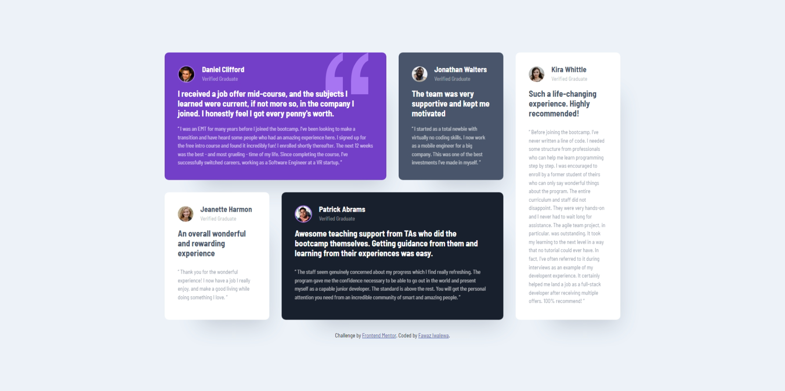

# Frontend Mentor - Testimonials Grid Section Solution

This is a solution to the [Testimonials Grid Section challenge on Frontend Mentor](https://www.frontendmentor.io/challenges/testimonials-grid-section-Nnw6J7Un7). Frontend Mentor challenges help you improve your coding skills by building realistic projects.

## Table of Contents

- [Frontend Mentor - Testimonials Grid Section Solution](#frontend-mentor---testimonials-grid-section-solution)
  - [Table of Contents](#table-of-contents)
  - [Overview](#overview)
    - [The Challenge](#the-challenge)
    - [Screenshot](#screenshot)
    - [Links](#links)
  - [My Process](#my-process)
    - [Built With](#built-with)
    - [What I Learned](#what-i-learned)
    - [Continued Development](#continued-development)
    - [Useful Resources](#useful-resources)
  - [Author](#author)
  - [Acknowledgments](#acknowledgments)

---

## Overview

### The Challenge

Users should be able to:

- View the optimal layout for the site depending on their device's screen size.

### Screenshot



### Links

- [Solution URL](https://github.com/fawaziwalewa/testimonials-grid-section)
- [Live Site URL](https://fawaziwalewa.github.io/testimonials-grid-section/)

---

## My Process

### Built With

- Semantic HTML5 markup
- CSS custom properties
- Flexbox
- CSS Grid
- Mobile-first workflow

---

### What I Learned

This project allowed me to strengthen my understanding of **CSS Grid** and how to structure layouts that adapt seamlessly to different screen sizes. I also practiced using **box shadows** and aligning components with **Flexbox** for individual card elements.

Here's an example of how I utilized CSS Grid for the layout:

```css
.container {
  display: grid;
  grid-template-columns: repeat(4, 1fr);
  gap: 24px;
}
```

---

### Continued Development

In future projects, I plan to focus on:

- Improving accessibility through ARIA roles and semantic HTML.
- Experimenting with more advanced **CSS Grid** techniques.
- Ensuring better browser compatibility for responsive designs.

---

### Useful Resources

- [MDN Web Docs](https://developer.mozilla.org/en-US/docs/Web/CSS/CSS_Grid_Layout) - Helped me understand CSS Grid properties in-depth.
- [CSS Tricks: Complete Guide to Grid](https://css-tricks.com/snippets/css/complete-guide-grid/) - A comprehensive guide to mastering CSS Grid.

---

## Author

- Website - [Fawaz Iwalewa](https://iwaola.me)
- Frontend Mentor - [@fawaziwalewa](https://www.frontendmentor.io/profile/fawaziwalewa)
- GitHub - [@fawaziwalewa](https://github.com/fawaziwalewa)

---

## Acknowledgments

I’d like to thank the Frontend Mentor community for their resources and feedback, which greatly helped improve the quality of this solution.
